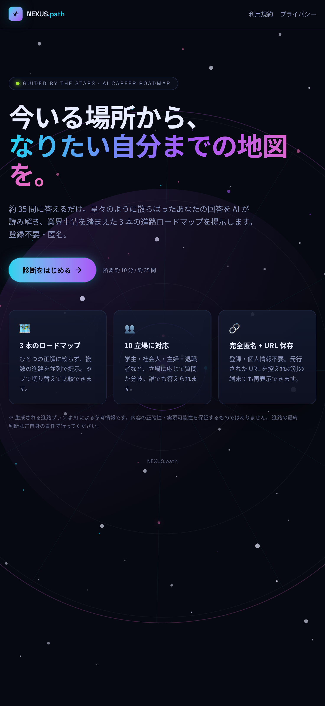
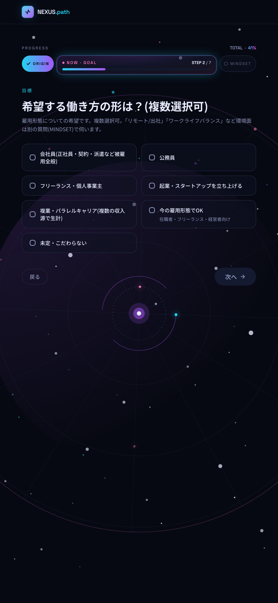
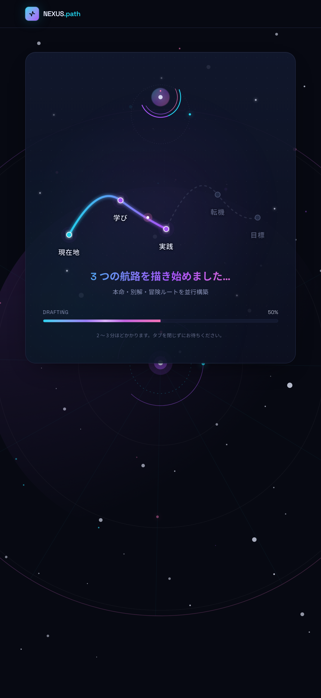
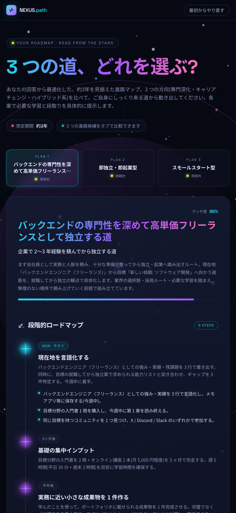

# 進路提案アプリ NEXUS.path(仮 AI命名)

現在地・目標・性格/価値観を読み解き、AI が進路ロードマップを 3 案提示する Web アプリ。

---

## 特徴

- **現状からゴールまでのロードマップを生成** — いまの労働状況からなりたい自分までを、AI が段階的なステップに分解して提示する
- **選択肢を絞らない 3 案提示** — ひとつの正解に絞らず、複数の進路を並列で比較できる
- **PC とスマートフォン、どちらの画面サイズでも読みやすいレスポンシブ設計**
- **長い待ち時間を視覚的に楽しめるロードアニメーション** — AI の生成に 2〜3 分かかるため、待ち時間そのものを体験として設計
- **結果の URL 保存・再表示** — 生成された結果は URL を保存しておくと後から再度確認できる

---

## 画面イメージ

| トップ | 質問 | ロード | 結果 |
|---|---|---|---|
|  |  |  |  |

---

## 技術スタック

| レイヤー | 採用技術 |
|---|---|
| フレームワーク | Next.js 16(App Router) |
| UI | React 19 + Tailwind CSS v4 |
| 言語 | TypeScript(strict) |
| スキーマ検証 | Zod |
| AI | Gemini 2.5 Pro / Flash |
| ストレージ | SQLite(ローカル開発) / Neon Postgres(本番) |
| テスト | Vitest |

### 実装上の工夫

- **AI 出力は Zod で再検証** — モデル側の `responseSchema` に加えて、最終形は `CareerPlanSchema` で必ず通す。失敗時は 1 回リトライ。
- **環境変数は起動時に Zod 検証** — `AI_PROVIDER=gemini` なのにキーが無い、といった設定ミスは起動時に分かりやすく落とす。
- **生成中の離脱防止 UX** — 2〜3 分の生成中に `beforeunload` + `popstate` でガード。誤って閉じないよう確認ダイアログを出す。
- **SSR-safe な背景演出** — `Math.random()` は SSR 不整合の元になるため、seed 固定の決定論的乱数で座標を生成。

---

## ローカル起動方法

```bash
# 1. 依存をインストール
npm install

# 2. 環境変数を用意(既定の mock + sqlite で動く)
cp .env.example .env.local

# 3. 開発サーバー起動
npm run dev
# → http://localhost:3000
```

既定では **API キー不要・課金なしの Mock AI** と **ローカル SQLite** で、トップから質問フロー、結果生成までの一連が動く。SQLite ファイルは `./data/dev.sqlite` に作成(gitignore 済み)。

> Node.js は 18.18+ / 20+ 推奨(Next.js 16 / React 19 の要件)。

### 環境変数

すべてサーバー側専用(`NEXT_PUBLIC_` は付けない)。`.env*` は gitignore 済み。

| 変数 | 必須 | 例 / 既定 | 説明 |
|---|---|---|---|
| `AI_PROVIDER` | 任意 | `mock`(既定) / `gemini` | 使用する AI 実装 |
| `GEMINI_API_KEY` | `gemini` 時必須 | `AIza...` | Gemini API キー |
| `GEMINI_MODEL` | 任意 | `gemini-2.5-flash`(既定) | 使う Gemini モデル |
| `DB_PROVIDER` | 任意 | `sqlite`(既定) / `neon` | 使用するストレージ実装 |
| `DATABASE_URL` | `neon` 時必須 | `postgres://...` | Neon / Vercel Postgres 接続文字列 |
| `SQLITE_PATH` | 任意 | `./data/dev.sqlite`(既定) | ローカル SQLite ファイルパス |
| `APP_BASE_URL` | 任意 | `http://localhost:3000`(既定) | 結果 URL の組み立てに使う |

`AI_PROVIDER=gemini` なのに `GEMINI_API_KEY` が無い場合、`DB_PROVIDER=neon` なのに `DATABASE_URL` が無い場合は、起動時に分かりやすいエラーで落ちる。

---

## コマンド一覧

```bash
npm run dev        # 開発サーバー
npm run build      # 本番ビルド
npm run start      # 本番ビルドを起動
npm run test       # Vitest
npm run typecheck  # tsc --noEmit
npm run lint       # ESLint
```

---

## ディレクトリ構成(抜粋)

```
src/
├ app/
│  ├ page.tsx                # トップ(LP)
│  ├ diagnosis/page.tsx      # ウィザード(同意ゲート → 一問一答 → 生成)
│  ├ r/[id]/page.tsx         # 結果表示(RSC で取得)
│  ├ legal/{privacy,terms}/  # プライバシーポリシー / 利用規約
│  ├ api/generate/route.ts   # 生成エンドポイント
│  └ robots.ts
├ components/
│  ├ wizard/                 # ConsentGate / Wizard / 各入力UI / ProgressBar
│  ├ result/                 # 結果画面の各セクション
│  └ ui/
├ lib/
│  ├ questions/              # 質問定義 + 分岐エンジン(純粋関数)
│  ├ ai/                     # AIProvider IF + Mock / Gemini + ファクトリ
│  ├ schema/                 # 回答 / 結果 / リクエストの Zod
│  ├ db/                     # ResultsRepository IF + SQLite / Neon + ファクトリ
│  └ id.ts
└ env.ts                     # 環境変数の Zod 検証・集約
```

---

## プライバシー / データ方針

- 保存するのは **生成結果(構造化 JSON)のみ**。入力の生回答・IP・トラッキング ID は保存しない。
- ログにも回答本文・結果本文は残さない(プロバイダ名・所要時間・成否のみ)。
- 結果ページと診断ページは `noindex` + `robots.txt` で検索エンジンから除外。
- 生成は同意必須。`POST /api/generate` は `consent: true` でなければ拒否。
- DB ベースのレート制限を実装(同一識別子からの過剰リクエストを抑制)。

詳細はプライバシーポリシー(`/legal/privacy`)と利用規約(`/legal/terms`)を参照。
